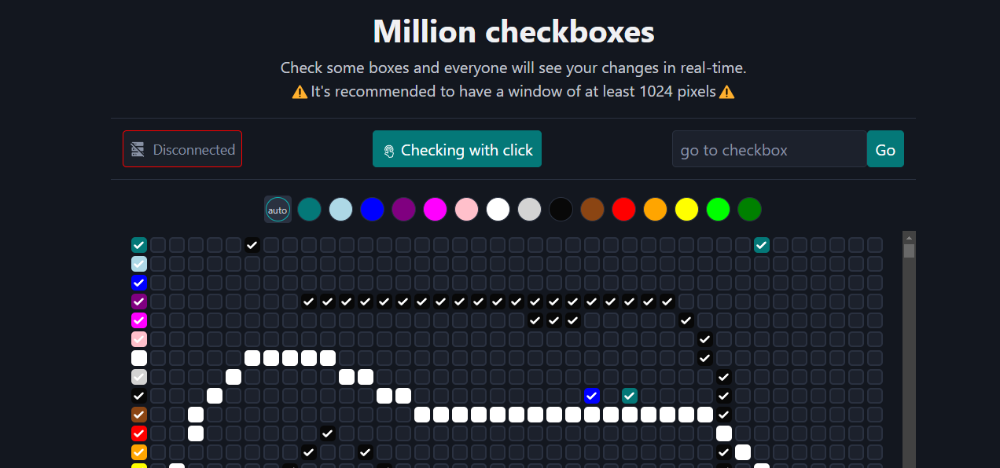

# One Million Checkboxes

Inspired by [OneMillionCheckboxes](https://en.wikipedia.org/wiki/One_Million_Checkboxes) but with colors

You can play with it on <https://million-checkboxes.4jairo.tech>



## Backend

- https://github.com/4jairo/million-checkboxes-backend.git

## Features

The checkboxes are backed by a Redis database, using a bitmap of 4 million bits, where each checkbox uses 4 bits (2^4bits = 16 different colors).

## Installation
To get started with the project, clone the repository and install the dependencies:

- Frontend
```bash
git clone https://github.com/4jairo/million-checkboxes-frontend.git
cd million-checkboxes-backend
npm install
```

- Backend
```bash
git clone https://github.com/4jairo/million-checkboxes-backend.git
cd million-checkboxes-backend
cargo build
```

## Usage
To run the application locally, use the following command:

- Frontend
```bash
npm run dev
```

- Backend
```bash
docker run -p6379:6379 --name millioncheckboxes -d redis # start redis databse
cargo run

# or

docker compose up
```


Then, open your browser and navigate to `http://localhost:5173`.

## Contributing
Contributions are welcome! Please fork the repository and submit a pull request.